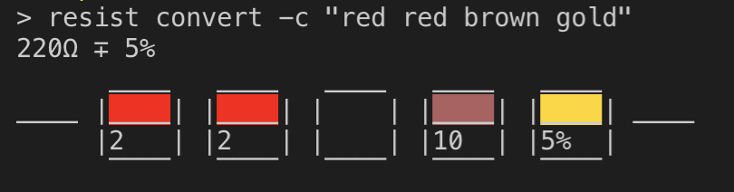

# resist

This utility takes colors of a resistor to calculate its resistance and tolerance.



## Usage

```
$ resist convert -c "red red brown gold"
220Ω ∓ 5%
      ____   ____   ____   ____   ____
____ |    | |    | |    | |    | |    | ____
     |2   | |2   | |    | |10  | |5%  |
      ‾‾‾‾   ‾‾‾‾   ‾‾‾‾   ‾‾‾‾   ‾‾‾‾
```

## Resources

- [Resistor Color Code Calculator](http://www.resistorguide.com/resistor-color-code-calculator/)
- [NPM: Resistor Packages](https://www.npmjs.com/search?q=resistor)
- [NPM: Commander](https://www.npmjs.com/package/commander)
- [NPM: Chalk](https://github.com/chalk/chalk)
